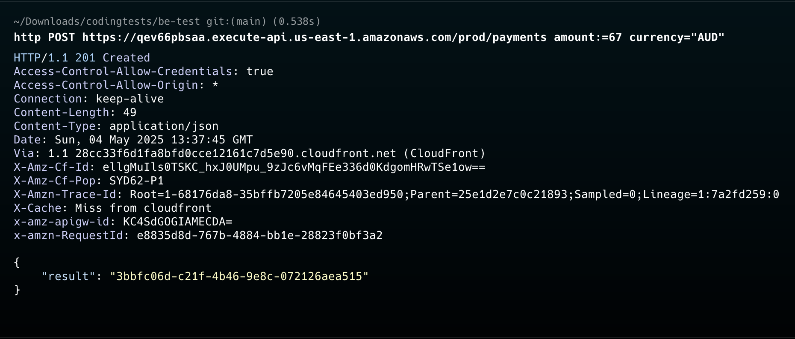
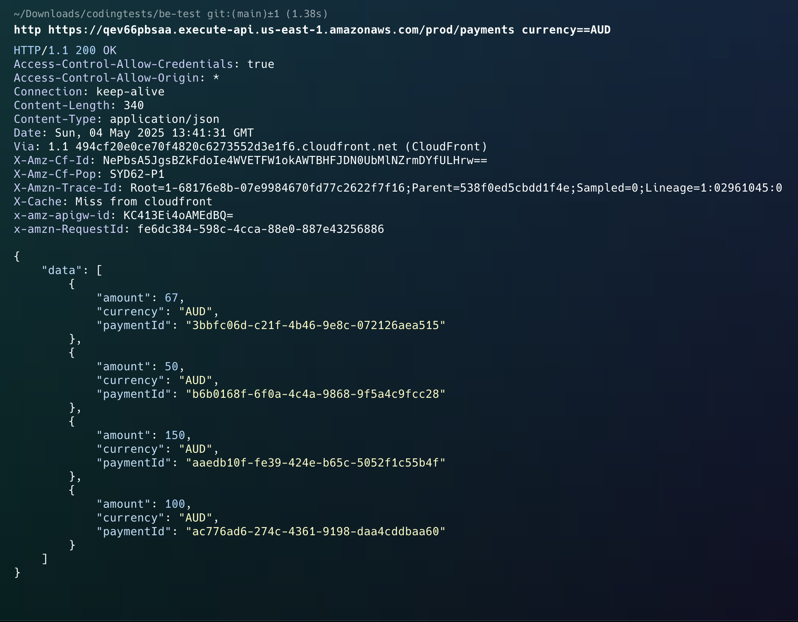

# OFX Backend Coding Test
The OFX platform allows users to make and manage payments anywhere in the world. Some of the OFX clients use this capability as a baseline to build bespoke products in their respective places via our API.
  
The code provided to you provides the skeleton for a payments API, with some of the critical functionality missing. In this task you'll complete the API and add in additional endpoints to support a better experience for API users.

The code is a reflection of our real stack, using API Gateway, AWS Lambda and DynamoDB, however **the tests and the handler code can be run locally**.
  
If you want to deploy this code to your own AWS account to test it, you can run `npm run deploy` from the root directory. 

## Question 1
The API handler for `getPayment` simply goes to the database to retrieve a payment with the matching payment ID. The handler is currently unimplemented (`src/getPayment.ts`), simply throwing an error, however the test for the handler is fully completed (`test/getPayment.test.ts`).
  
Implement the handler so that the test now passes.

## Question 2
The handler for `createPayment` allows users to enter a new payment into the database. In the current implementation, users get to choose their own ID for the payment. Unfortunately this can lead users to selecting values that aren't unique, creating problems when trying to store the results.

Update the `createPayment` handler so that is generates its own unique ID when called, and returns that ID to the user when completed.

## Question 3
The endpoint `getPayment` allows users to request any payment based on a given ID. However, sometimes a user will send a request with no match.

Update `getPayment` so that if a matching payment is not found in the database, it returns a `HTTP 404` response to the caller.
 
## Question 4
When the `createPayment` endpoint is called, it's currently accepting any input sent to it by the user. This could lead to invalid or bad data being stored in our database.
  
Update `createPayment` so that the request is validated before it's stored in the database. You should return a `HTTP 422` error to the caller if they provide you with data that isn't acceptable.
  
## Question 5
The `listPayments` endpoint allows callers to get a list of all payments they've submitted to OFX. API users are now asking for the ability to search based on currency. E.g. they want to be able to find a list of all SGD payments submitted to OFX.
  
Update the API so that users can fetch a list of payments by currency.
  
**Hint**: DynamoDB allows you to add `FilterExpressions` to your queries in order to narrow down your search results. You can find out more about those expressions in the DynamoDB documentation.

